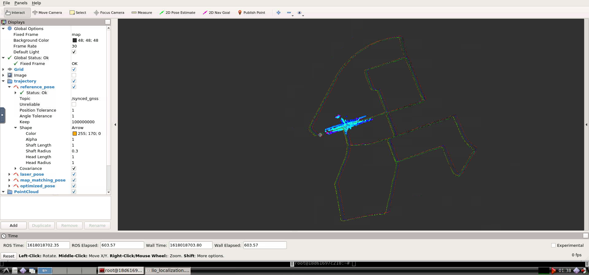
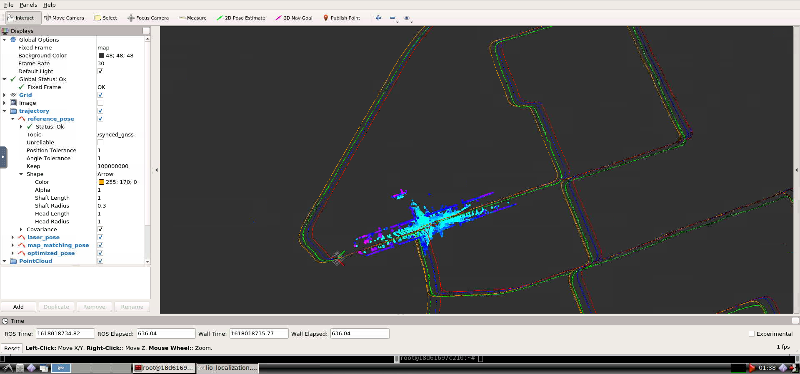
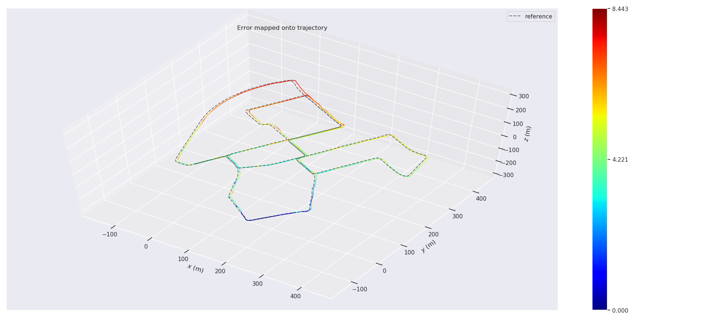
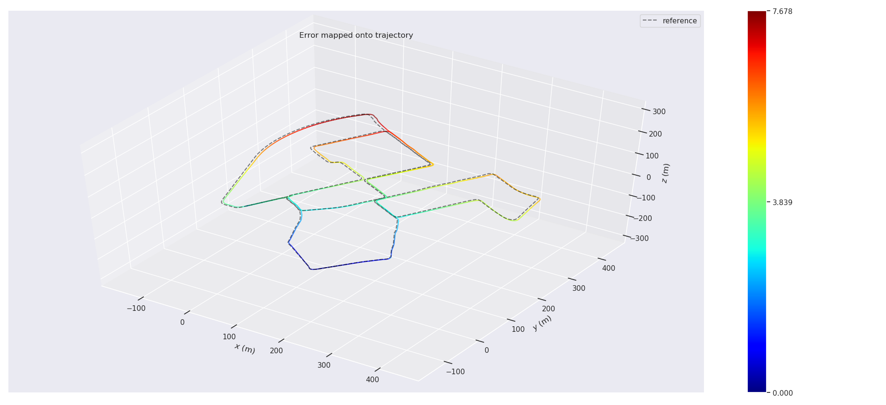

# 第十章作业

基于图优化的滑动窗模型包含：
* 地图匹配位姿和优化变量的残差
* 激光里程计相对位姿和优化变量的残差
* IMU预积分和优化变量的残差
* 边缘化形成的先验因子对应的残差

所以首先需要推导各残差关于优化变量的雅可比

## 1. 推导各残差关于优化变量的雅可比

### 地图匹配位姿和优化变量的残差雅可比

### 激光里程计相对位姿和优化变量的残差雅可比

### IMU预积分和优化变量的残差雅可比

### 边缘化形成的先验因子对应的残差雅可比

## 2. 基于图优化的定位

作业是**参考了葛垚大佬的推导**，先完成了代码补全，运行起来看了一下效果

|  | Optimized | LidarOdometry |
|:----:   | :-----: | :-----: |
| Map |  |  |

| APE  | Optimized | LidarOdometry |
|:----:   | :-----: | :-----: |
| max | 8.442891 | 7.678134 |
| mean | 4.747836 | 4.170015 |
| median | 4.815285 | 4.252581 |
| min | 0.000002 | 0.000002 |
| rmse | 5.008378 | 4.514122 |
| sse | 113554.602350 | 92248.011402 |
| std | 1.594337 | 1.728660 |

