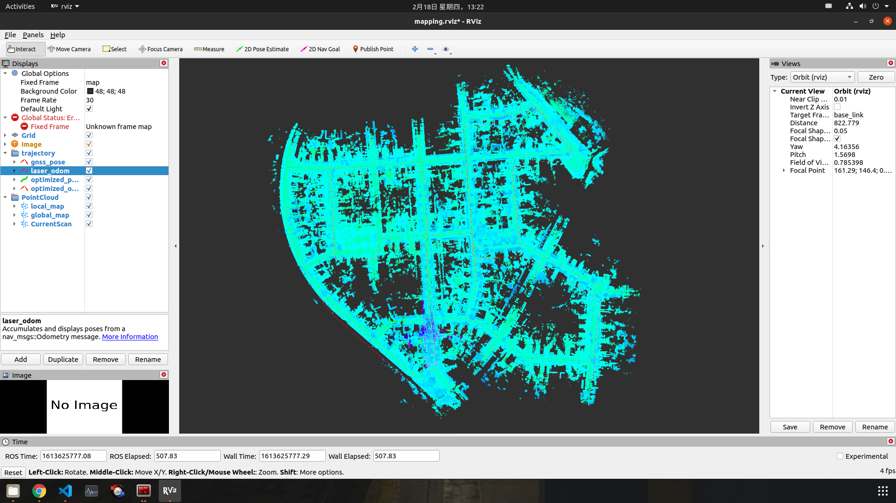
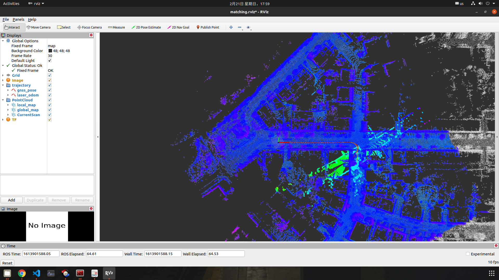
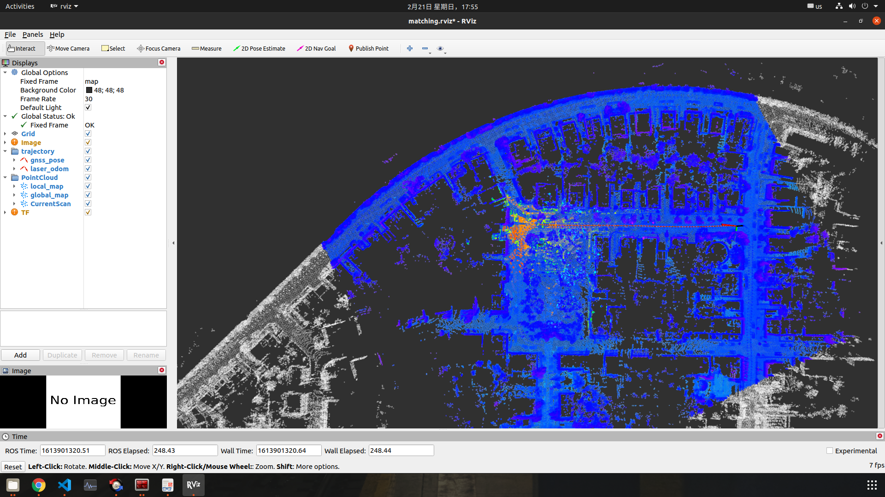
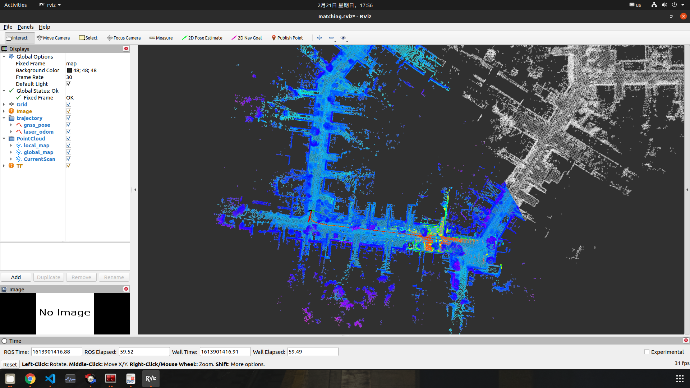
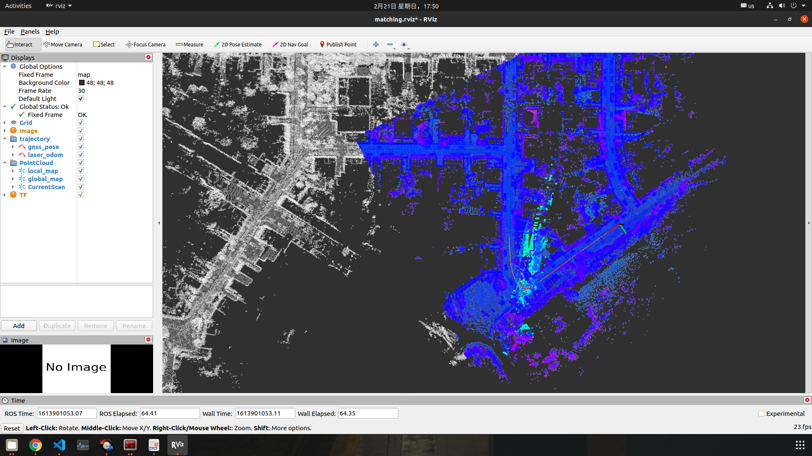
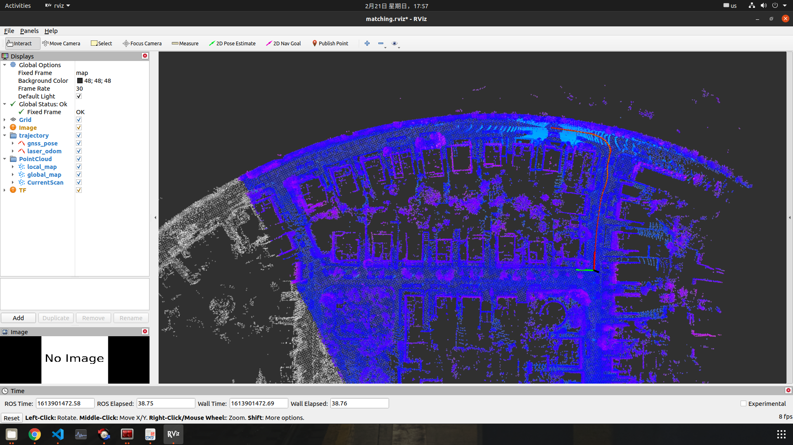

# 第四章作业

## 1. 跑通建图流程

## 2. 实现全局初始化
在建图的基础上，实现全局初始化，需要知道定位初始时刻相对于所建地图原点的位姿。所建地图原点为`Mapping`时`InitOriginPosition`的**GPS**位置，将这个**GPS**位置保存下来，在`Matching`时，以这个**GPS**位置为原点将后续的**GNSS**数据转换到LocalENU坐标系下，再在`Matching`时使用`SetGNSSPose`设置初始位姿并加载局部地图进行匹配完成任意位置初始化过程。
* 地图原点初始化

* 100S时初始化

* 200S时初始化

* 300S时初始化

* 400S时初始化

过程中发现全局初始化成功，运行一段时间后，基于地图的定位会不准，尤其是在转弯的地方，问题还在排查中。