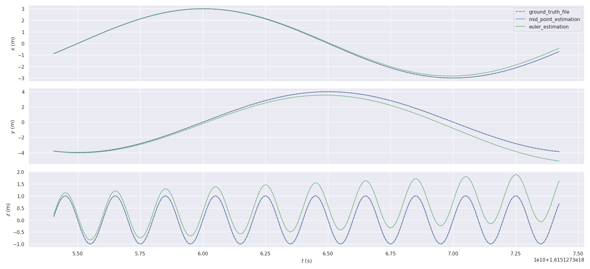
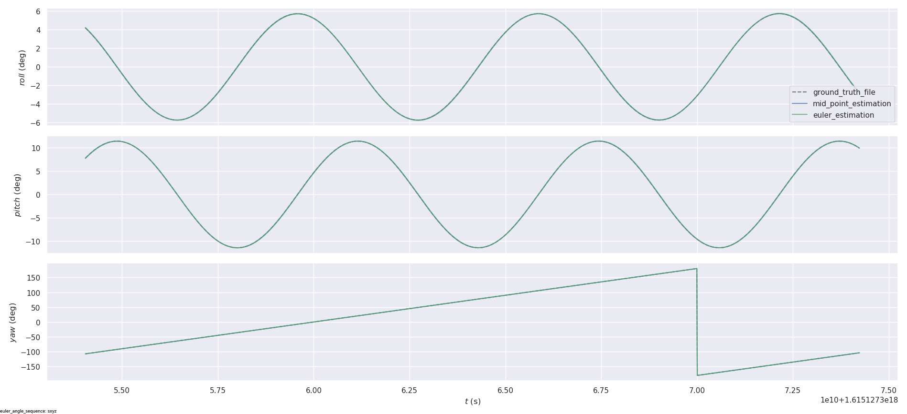
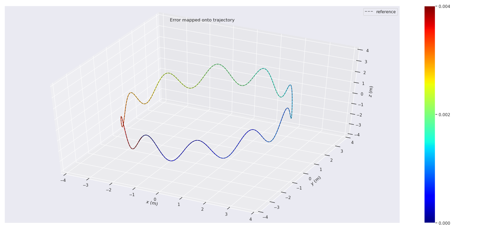
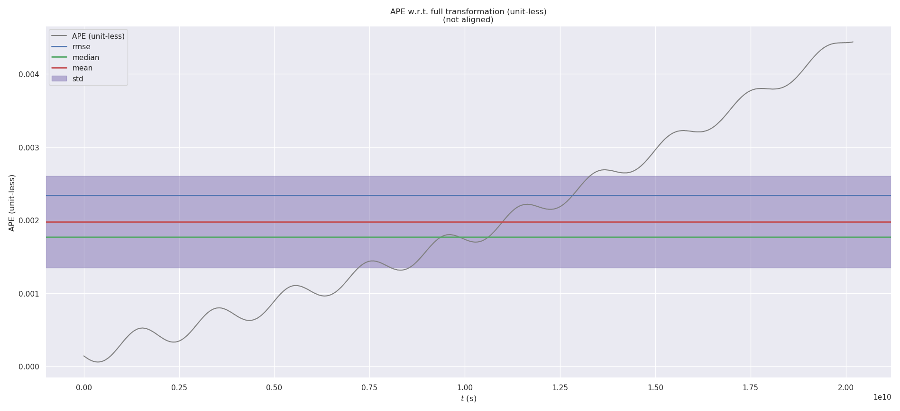
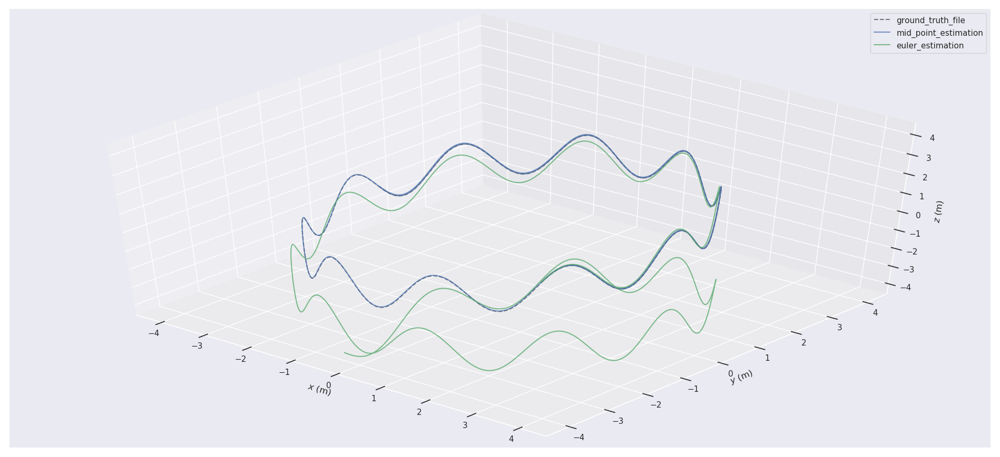
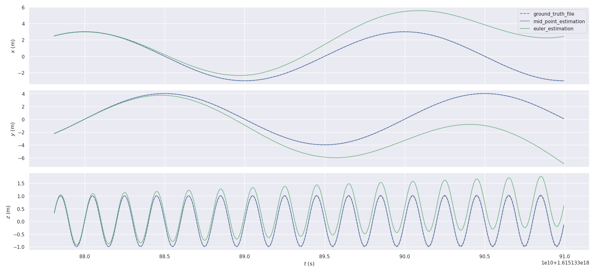
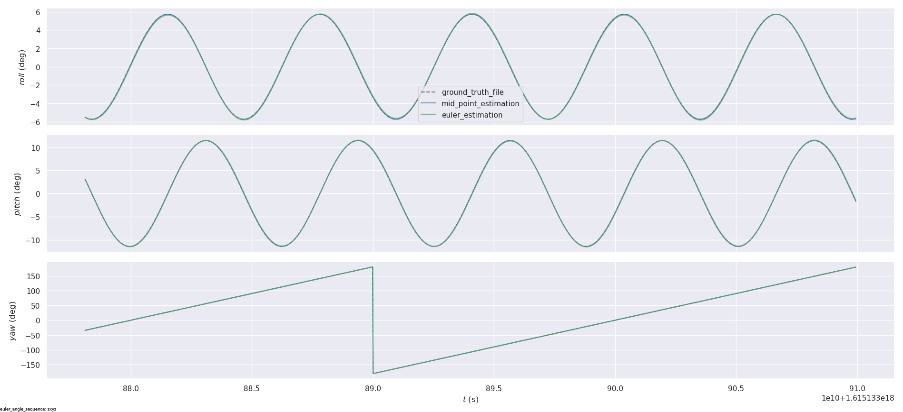
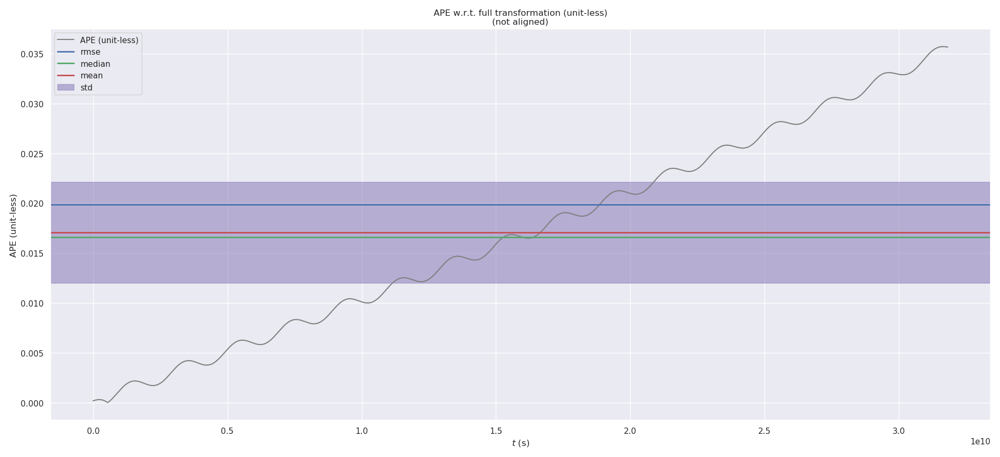
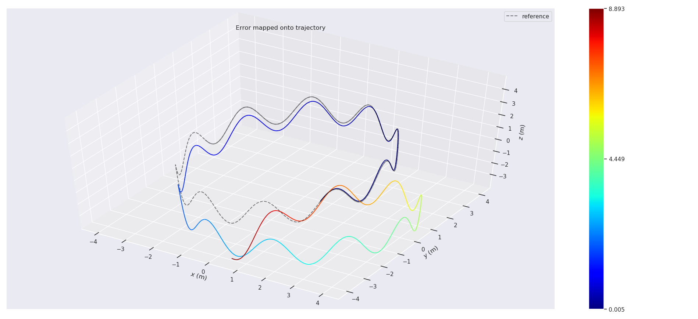
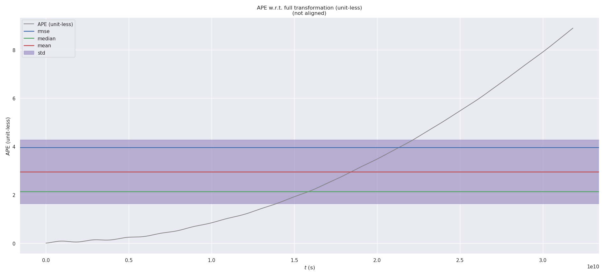

# 第六章作业

## 本地环境配置
因为使用的是本地Ubuntu20.04环境，需要开源代码[gnss-ins-sim](https://github.com/Aceinna/gnss-ins-sim)，提前安装到`Python`库里

```bash
git clone https://github.com/Aceinna/gnss-ins-sim.git
cd gnss-ins-sim
sudo python setup.py install
```

~~为什么buffer的长度要小于等于3？实际解算的第一个作为上一次的IMUData，那当前IMUData设为第几个呢？~~
```cpp
if (imu_data_buff_.size() < static_cast<size_t>(3))
    return false;
```
可以通过选取不同的当前IMUData完成变步长积分

## 基于中值法的解算

```cpp
void Activity::MidPointIntegration(const IMUData& imu_data_curr) {
    auto imu_data_prev = last_imu_data;

    double dt = imu_data_curr.time - imu_data_prev.time;

    // 解算姿态
    Eigen::Vector3d angular_delta;
    angular_delta = (imu_data_prev.angular_velocity - angular_vel_bias_ + imu_data_curr.angular_velocity - angular_vel_bias_) * dt / 2.0;
    double angular_mag = angular_delta.norm();
    
    Eigen::Vector3d angular_delta_dir = angular_delta.normalized();
    double delta_sin = sin(angular_mag / 2.0);
    double delta_cos = cos(angular_mag / 2.0);
    
    Eigen::Quaterniond dq;
    dq.w() = delta_cos;
    dq.x() = delta_sin * angular_delta_dir.x();
    dq.y() = delta_sin * angular_delta_dir.y();
    dq.z() = delta_sin * angular_delta_dir.z();
    Eigen::Quaterniond q_prev(pose_.block<3,3>(0,0));
    Eigen::Quaterniond q_cur = q_prev * dq;
    q_cur.normalize();

    // 解算速度
    Eigen::Vector3d acc_prev = q_prev * (imu_data_prev.linear_acceleration - linear_acc_bias_) - G_;
    Eigen::Vector3d acc_cur = q_cur * (imu_data_curr.linear_acceleration - linear_acc_bias_) - G_;
    Eigen::Vector3d delta_velocity = (acc_prev + acc_cur) * dt / 2.0;
    Eigen::Vector3d cur_velocity = vel_ + delta_velocity;
    // 解算位置
    Eigen::Vector3d pos_prev = pose_.block<3,1>(0,3);
    Eigen::Vector3d pos_cur = pos_prev + (cur_velocity + vel_) * dt / 2.0;

    pose_.block<3,3>(0,0) = q_cur.toRotationMatrix();
    pose_.block<3,1>(0,3) = pos_cur;
    vel_ = cur_velocity;
}
```

基于`ROS`的`message_filters::sync_policies::ApproximateTime`获取同一时刻的真值位姿和估算位姿，然后保存成`txt`文件，用`evo`工具进行对比分析，详见[evaluation/node.cpp](../../src/imu_integration/src/evaluation/node.cpp)

## 中值法和欧拉法对比分析
### 间隔一个IMUData，步长为1
#### 轨迹对比



#### 误差分析
* 中值法
  
  
  ```bash
  APE w.r.t. full transformation (unit-less)
       max	0.004440
      mean	0.001974
    median	0.001768
       min	0.000057
      rmse	0.002339
       sse	0.008436
       std	0.001254
  ```

* 欧拉法
  
  
  ```bash
    APE w.r.t. full transformation (unit-less)
         max	1.582622
        mean	0.729799
      median	0.665904
         min	0.096685
        rmse	0.841593
         sse	1092.166059
         std	0.419133
  ```
### 间隔两个IMUData，步长为2
#### 轨迹对比



#### 误差分析
* 中值法
  
  
  ```text
  APE w.r.t. full transformation (unit-less)
       max	0.035714
      mean	0.017071
    median	0.016609
       min	0.000013
      rmse	0.019856
       sse	0.486518
       std	0.010141
  ```
* 欧拉法
  
  
  ```text
  APE w.r.t. full transformation (unit-less)
       max	8.892604
      mean	2.955480
    median	2.133966
       min	0.004809
      rmse	3.965236
       sse	19402.303659
       std	2.643527
  ```
可以看出，在作业中的运动情况下，中值法解算位姿相较于欧拉法，误差累积较慢，精度较高。增大积分步长，中值法和欧拉法误差累积都会变快，对于欧拉法来说，误差累积会更快。

## 不同运动状况下中值法和欧拉法对比分析

