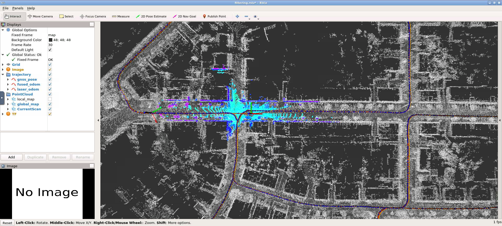

# 第七章作业

[作业要求](./Homework.md)

本地环境`Ubuntu20.04`和`ROS Noetic`，默认使用的是`tf2`和作业里的`tf`不是很兼容，会报`Warning: TF_REPEATED_DATA ignoring data with redundant timestamp for frame base_link at time 1432235782.066014 according to authority unknown_publisher`，`rviz`里显示`lidar odometry`和`fused_odometry`比`gnss_pose`要慢，所以还是切换到了`docker`环境。

## ESKF实现
[ESKF](../../src/lidar_loca/src/../../lidar_localization/src/models/kalman_filter/error_state_kalman_filter.cpp)代码补全

作业模型是在body系下，在预测的时候需要注意输入body系下加速度和角速度



## 参数对滤波性能影响

作业要求经过调试参数，滤波后性能比滤波前要好。

我的理解是在卡尔曼滤波中，每一时刻的状态量以预测值为基础，通过观测量对预测量进行修正，修正的大小由预测过程中的方差占整个滤波过程的总方差比值（即卡尔曼增益）和预测值与观测值的差值确定。

* 初始参数
  ```
  Error-State Kalman Filter params:
    gravity magnitude: 9.80943
    earth rotation speed: 7.29211e-05
    latitude: 0.854911

    prior cov. pos.: 1e-06
    prior cov. vel.: 1e-06
    prior cov. ori: 1e-06
    prior cov. epsilon.: 1e-06
    prior cov. delta.: 1e-06

    process noise gyro.: 0.0001
    process noise accel.: 0.0025

    measurement noise pose.: 
      pos: 0.0001, ori.: 0.0001
    measurement noise pos.: 0.0001
    measurement noise vel.: 0.0025

    motion constraint: 
      activated: true
      w_b threshold: 0.13

    KITTI Localization Fusion Method: error_state_kalman_filter
  ```
  | APE  | laser | fused |
  |:----:   | :-----: | :-----: |
  |max    | 1.069910 | 1.075653 |
  |mean   | 0.229665 | 0.233259 |
  |median | 0.155504 | 0.161472 |
  |min    | 0.014168 | 0.012523 |
  |rmse   | 0.292628 | 0.295345 |
  |sse    | 372.495768 | 379.443546 |
  |std    | 0.181342 | 0.181159 |

* 增大测量噪声
  ```
  Error-State Kalman Filter params:
    gravity magnitude: 9.80943
    earth rotation speed: 7.29211e-05
    latitude: 0.854911

    prior cov. pos.: 1e-06
    prior cov. vel.: 1e-06
    prior cov. ori: 1e-06
    prior cov. epsilon.: 1e-06
    prior cov. delta.: 1e-06

    process noise gyro.: 0.0001
    process noise accel.: 0.0025

    measurement noise pose.: 
      pos: 0.001, ori.: 0.001           # x 10
    measurement noise pos.: 0.001       # x 10
    measurement noise vel.: 0.0025

    motion constraint: 
      activated: true
      w_b threshold: 0.13

    KITTI Localization Fusion Method: error_state_kalman_filter
  ```
  | APE  | laser | fused |
  |:----:   | :-----: | :-----: |
  |max    | 1.069910 | 1.043313 |
  |mean   | 0.229641 | 0.234757 |
  |median | 0.155302 | 0.160687 |
  |min    | 0.014168 | 0.016803|
  |rmse   | 0.292616 | 0.297629 |
  |sse    | 372.635750 | 385.513689 |
  |std    | 0.181354 | 0.182954 |

* 继续增大测量噪声
  ```
  Error-State Kalman Filter params:
    gravity magnitude: 9.80943
    earth rotation speed: 7.29211e-05
    latitude: 0.854911

    prior cov. pos.: 1e-06
    prior cov. vel.: 1e-06
    prior cov. ori: 1e-06
    prior cov. epsilon.: 1e-06
    prior cov. delta.: 1e-06

    process noise gyro.: 0.0001
    process noise accel.: 0.0025

    measurement noise pose.: 
      pos: 0.005, ori.: 0.005             # x 50
    measurement noise pos.: 0.005       # x 50
    measurement noise vel.: 0.005       # x 2

    motion constraint: 
      activated: true
      w_b threshold: 0.13

    KITTI Localization Fusion Method: error_state_kalman_filter
  ```
  | APE  | laser | fused |
  |:----:   | :-----: | :-----: |
  |max    | 1.847445 | 1.875208 |
  |mean   | 0.902131 | 0.905219 |
  |median | 0.873231 | 0.873887 |
  |min    | 0.367366 | 0.248823 |
  |rmse   | 0.919321 | 0.923459 |
  |sse    | 3678.944126 | 3712.133102 |
  |std    | 0.176948 | 0.182633|

  > 为什么纯 laser 误差相较之前还会变大？ laser 应该一直不变啊

* 增大过程噪声
  ```
  Error-State Kalman Filter params:
    gravity magnitude: 9.80943
    earth rotation speed: 7.29211e-05
    latitude: 0.854911

    prior cov. pos.: 1e-06
    prior cov. vel.: 1e-06
    prior cov. ori: 1e-06
    prior cov. epsilon.: 1e-06
    prior cov. delta.: 1e-06

    process noise gyro.: 0.0001
    process noise accel.: 0.025       # x 10

    measurement noise pose.: 
      pos: 0.0001, ori.: 0.0001
    measurement noise pos.: 0.0001
    measurement noise vel.: 0.0025

    motion constraint: 
      activated: true
      w_b threshold: 0.13

    KITTI Localization Fusion Method: error_state_kalman_filter
  ```
  | APE  | laser | fused |
  |:----:   | :-----: | :-----: |
  |max    | 1.847445 | 1.892774 |
  |mean   | 0.902121 | 0.902615 |
  |median | 0.873124 | 0.872840 |
  |min    | 0.367366 | 0.276497 |
  |rmse   | 0.919364 | 0.920284 |
  |sse    | 3678.444673 | 3685.811193 |
  |std    | 0.177225 | 0.179470 |

  > 纯 laser 应该不受过程噪声和测量噪声影响，为什么测量噪声和过程噪声增大到一定值，纯 laser 误差会增大呢

## 不考虑IMU随机游走

$$
w = 
\begin{bmatrix}
  \eta_{a} \\
  \eta_{w} \\
  0 \\
  0
\end{bmatrix}
$$

$$
B_t = 
\begin{bmatrix}
  0 & 0 & 0 & 0 \\
  R_{t} & 0 & 0 & 0 \\
  0 & I_{3} & 0 & 0 \\
  0 & 0 & 0 & 0 \\
  0 & 0 & 0 & 0
\end{bmatrix}
$$

$$
B_{k-1}=
\begin{bmatrix}
  0 & 0 & 0 & 0 \\
  R_{k-1}T & 0 & 0 & 0 \\
  0 & I_{3}T & 0 & 0 \\
  0 & 0 & 0 & 0 \\
  0 & 0 & 0 & 0
\end{bmatrix}
$$

* Test1
```
Error-State Kalman Filter params:
  gravity magnitude: 9.80943
  earth rotation speed: 7.29211e-05
  latitude: 0.854911

  prior cov. pos.: 1e-06
  prior cov. vel.: 1e-06
  prior cov. ori: 1e-06
  prior cov. epsilon.: 1e-06
  prior cov. delta.: 1e-06

  process noise gyro.: 0.0001
  process noise accel.: 0.0025

  measurement noise pose.: 
    pos: 0.001, ori.: 0.001
  measurement noise pos.: 0.001
  measurement noise vel.: 0.0025

  motion constraint: 
    activated: true
    w_b threshold: 0.13

  KITTI Localization Fusion Method: error_state_kalman_filter

```
  | APE  | laser | fused |
  |:----:   | :-----: | :-----: |
  |max    | 1.847445 | 1.919796 |
  |mean   | 0.902115 | 0.909051 |
  |median | 0.873135 | 0.879738 |
  |min    | 0.367366 | 0.312198 |
  |rmse   | 0.919367 | 0.929530 |
  |sse    | 3702.974960 | 3785.299521 |
  |std    | 0.177269 | 0.194042 |

* Test2

