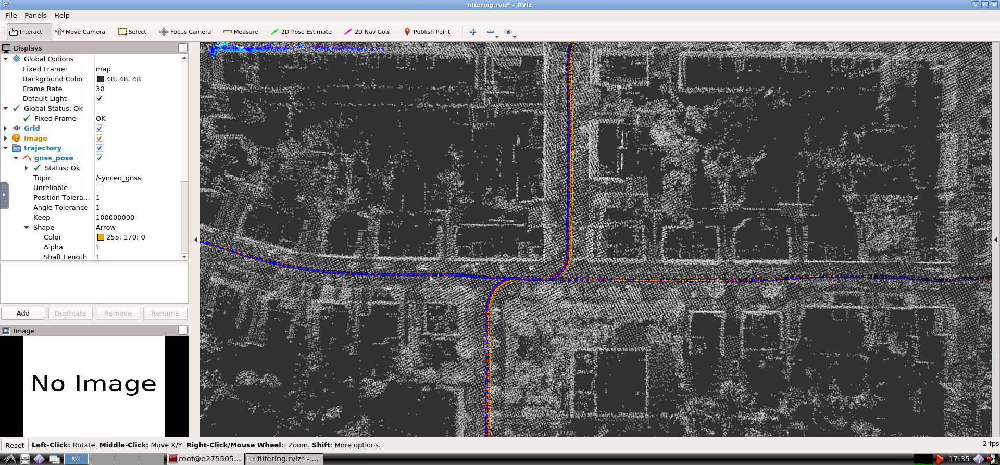
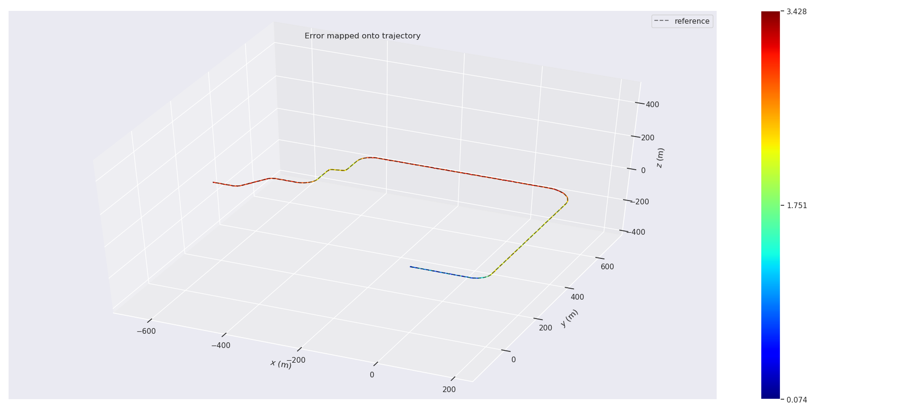
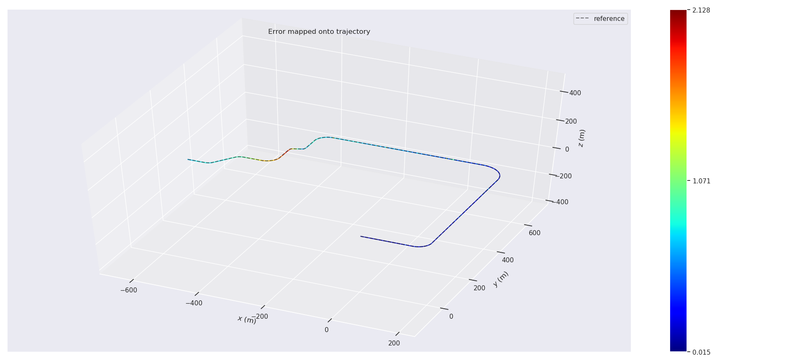

# 第八章作业

[作业要求](./Homework.md)

## 实现融合运动模型的滤波方法

可以仿照`CorrectErrorEstimationPoseVel`中的给`CorrectErrorEstimationPose`加上运动模型约束



* Test1
  ```bash
  error_state_kalman_filter:
    earth:
        # gravity can be calculated from https://www.sensorsone.com/local-gravity-calculator/ using latitude and height:
        gravity_magnitude: 9.80943
        # rotation speed, rad/s:
        rotation_speed: 7.292115e-5
        # latitude:
        latitude:   48.9827703173
    covariance:
        prior:
            pos: 1.0e-6
            vel: 1.0e-6
            ori: 1.0e-6
            epsilon: 1.0e-6
            delta: 1.0e-6
        process:
            gyro: 1.0e-4
            accel: 2.5e-3
        measurement:
            pose:
                pos: 1.0e-4
                ori: 1.0e-4
            pos: 1.0e-4
            vel: 2.5e-3
    motion_constraint: 
        activated: true
        w_b_thresh: 0.13
  ```
  | APE  | laser | fused |
  |:----:   | :-----: | :-----: |
  |max    | 2.706153 | 2.783004 |
  |mean   | 1.750127 | 1.751943 |
  |median | 1.728464 | 1.731996 |
  |min    | 1.000020 | 0.891633 |
  |rmse   | 1.759152 | 1.762624 |
  |sse    | 13607.027875 | 13660.785561 |
  |std    | 0.177962 | 0.193746 |

* Test2
  ```bash
  error_state_kalman_filter:
    earth:
        # gravity can be calculated from https://www.sensorsone.com/local-gravity-calculator/ using latitude and height:
        gravity_magnitude: 9.80943
        # rotation speed, rad/s:
        rotation_speed: 7.292115e-5
        # latitude:
        latitude:   48.9827703173
    covariance:
        prior:
            pos: 1.0e-6
            vel: 1.0e-6
            ori: 1.0e-6
            epsilon: 1.0e-6
            delta: 1.0e-6
        process:
            gyro: 1.0e-4
            accel: 2.5e-3
        measurement:
            pose:
                pos: 1.0e-3   # x10
                ori: 1.0e-3   # x10
            pos: 1.0e-3       # x10
            vel: 2.5e-3
    motion_constraint: 
        activated: true
        w_b_thresh: 0.13
  ```

  | APE  | laser | fused |
  |:----:   | :-----: | :-----: |
  |max    | 1.847445 | 1.890410 |
  |mean   | 0.902068 | 0.917762 |
  |median | 0.873098 | 0.892060 |
  |min    | 0.367366 | 0.358313 |
  |rmse   | 0.919268 | 0.937960 |
  |sse    | 3708.941335 | 3861.305624 |
  |std    | 0.176994 | 0.193600 |


## 实现gps位置和编码器的滤波融合

这个好像第八章作业框架代码已经实现了啊

[配置文件](../../src/lidar_localization/config/filtering/gnss_ins_sim_filtering.yaml)里选择`position_velocity`融合策略

* gnss
  
* fused
  