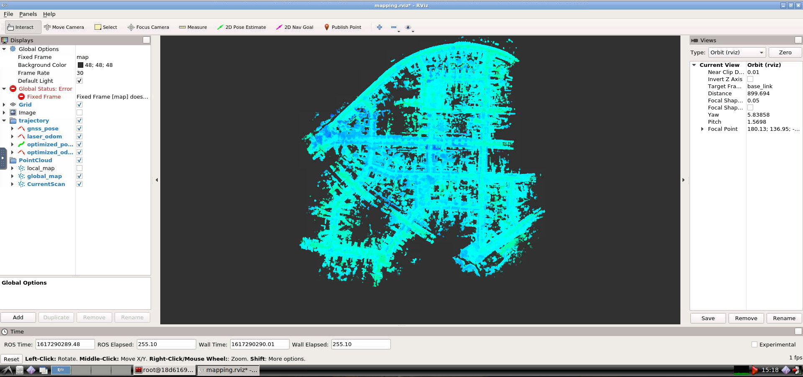
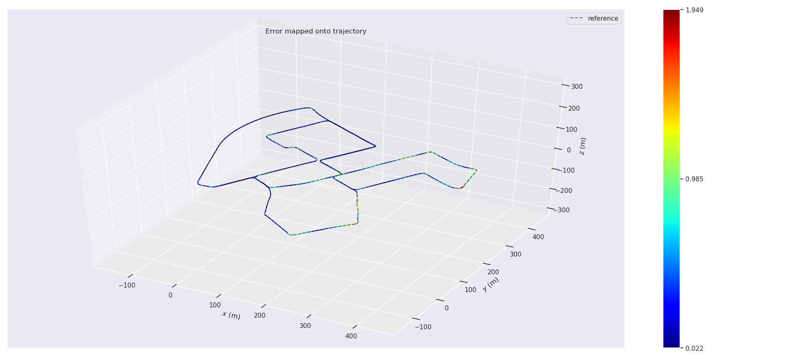
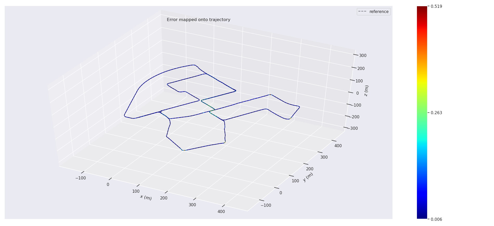
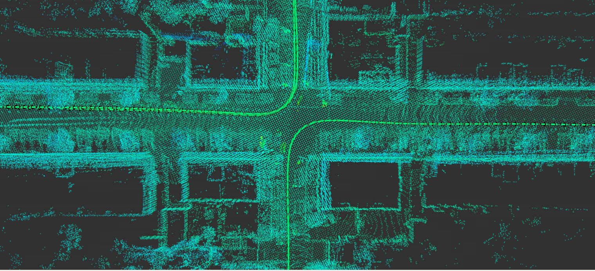

# 第九章作业

## 1. 实现基于IMU预积分的Lidar Mapping

### 补全IMU预积分相关代码

主要是`F`和`B`:

```c++
// F12 & F32:
F_.block<3, 3>(INDEX_BETA, INDEX_THETA) = -0.50 * (prev_R_a_hat + curr_R_a_hat * dR_inv);
F_.block<3, 3>(INDEX_ALPHA, INDEX_THETA) = 0.50 * T * F_.block<3, 3>(INDEX_BETA, INDEX_THETA);
// F14 & F34:
F_.block<3, 3>(INDEX_BETA,   INDEX_B_A) = -0.50 * (prev_R + curr_R);
F_.block<3, 3>(INDEX_ALPHA,   INDEX_B_A) = 0.50 * T * F_.block<3, 3>(INDEX_BETA,   INDEX_B_A);
// F15 & F35:
F_.block<3, 3>(INDEX_BETA,   INDEX_B_G) = +0.50 * T * curr_R_a_hat;
F_.block<3, 3>(INDEX_ALPHA,   INDEX_B_G) = 0.50 * T * F_.block<3, 3>(INDEX_BETA,   INDEX_B_G);
// F22:
F_.block<3, 3>(INDEX_THETA, INDEX_THETA) = -Sophus::SO3d::hat(w_mid);
```

```c++
// G11 & G31:
B_.block<3, 3>(INDEX_BETA, INDEX_ALPHA) = 0.5 * prev_R;                                                     //G31
B_.block<3, 3>(INDEX_ALPHA, INDEX_ALPHA) = 0.5 * T * B_.block<3, 3>(INDEX_BETA, INDEX_ALPHA);               //G11
// G12 & G32:
B_.block<3, 3>(INDEX_BETA, INDEX_THETA) = -0.25 * T * curr_R_a_hat;                                         //G32
B_.block<3, 3>(INDEX_ALPHA, INDEX_THETA) = 0.5 * T * B_.block<3, 3>(INDEX_BETA, INDEX_THETA);              //G31
// G13 & G33:
B_.block<3, 3>(INDEX_BETA, INDEX_BETA) = 0.5 * curr_R;                                                      //G33
B_.block<3, 3>(INDEX_ALPHA, INDEX_BETA) = 0.5 * T * B_.block<3, 3>(INDEX_BETA, INDEX_BETA);                 //G13
// G14 & G34:
B_.block<3, 3>(INDEX_BETA, INDEX_B_A) = -0.25 * T * curr_R_a_hat;                                           //G14
B_.block<3, 3>(INDEX_ALPHA, INDEX_B_A) = 0.5 * T * B_.block<3, 3>(INDEX_BETA, INDEX_B_A);                   //G34
```

计算残差:
```c++
Eigen::Vector3d alpha_ij = _measurement.block<3, 1>(0, 0);
Eigen::Vector3d theta_ij = _measurement.block<3, 1>(3, 0);
Eigen::Vector3d beta_ij = _measurement.block<3, 1>(6, 0);

_error.block<3, 1>(INDEX_P, 0) = ori_i.inverse() * (pos_j - pos_i - (vel_i - 0.5 * g_ * T_) * T_) - alpha_ij;
_error.block<3, 1>(INDEX_R, 0) = (Sophus::SO3d::exp(theta_ij).inverse() * ori_i.inverse() * ori_j).log();
_error.block<3, 1>(INDEX_V, 0) = ori_i.inverse() * (vel_j - vel_i + g_ * T_) - beta_ij;
_error.block<3, 1>(INDEX_A, 0) = b_a_j - b_a_i;
_error.block<3, 1>(INDEX_G, 0) = b_g_j - b_g_i;
```

更新:
```c++
_estimate.pos += Eigen::Vector3d(
    update[0], update[1], update[2]
);
_estimate.ori = _estimate.ori * Sophus::SO3d::exp(
    Eigen::Vector3d(update[3], update[4], update[5])
);
_estimate.vel += Eigen::Vector3d(
    update[6], update[7], update[8]
);

Eigen::Vector3d d_b_a_i = Eigen::Vector3d(
    update[9], update[10], update[11]
);

Eigen::Vector3d d_b_g_i = Eigen::Vector3d(
    update[12], update[13], update[14]
);

_estimate.b_a += d_b_a_i;
_estimate.b_g += d_b_g_i;

updateDeltaBiases(d_b_a_i, d_b_g_i);
```

作业框架中保存位姿的文件应该是弄反了，实际`laser_odom`文件保存的是`ground_truth`
```c++
// write GNSS/IMU pose and lidar odometry estimation as trajectory for evo evaluation:
for (size_t i = 0; i < optimized_key_frames_.size(); ++i) {
    // a. ground truth, IMU/GNSS:
    current_pose = key_frames_deque_.at(i).pose;
    current_pose(2, 3) = 0.0f;
    SavePose(ground_truth_ofs_, current_pose);
    // b. lidar odometry:
    current_pose = key_gnss_deque_.at(i).pose;
    current_pose(2, 3) = 0.0f;
    SavePose(laser_odom_ofs_, current_pose);
    // c. optimized odometry:
    current_pose = optimized_key_frames_.at(i).pose;
    current_pose(2, 3) = 0.0f;
    SavePose(optimized_pose_ofs_, current_pose);
}
```

### 结果分析
* 运行时截图
  
  

* 对比分析
  
  | APE  | WithImuPre | WithoutIMUPre |
  |:----:   | :-----: | :-----: |
  | max | 1.948571 | 0.519413 |
  | mean | 0.413407 | 0.067246 |
  | median | 0.337505 | 0.046663 |
  | min | 0.022000 | 0.006491 |
  | rmse | 0.520510 | 0.089805 |
  | sse | 518.561422 | 15.428083 |
  | std | 0.316268 | 0.059522 |

  
  |  | WithImuPre | WithoutIMUPre |
  |:----:   | :-----: | :-----: |
  | Traj |  |  |
  | Map |  |  |

  目前通过调试参数发现并不能使加了IMU预积分的轨迹误差**小于**不加IMU预积分的轨迹误差，个人理解是通过 `Lidar` + `loop closure`方式已经能比较精确的建图了，引入`IMU`预积分之后改变了残差结构，每项残差根据权重对优化变量产生不同的影响，最后结果是不同残差共同作用的结果。所以多传感器融合个人觉得不一定能提升精度，更多的是不同传感器之间的优势互补，提升系统的鲁棒性，比如单目视觉和IMU的融合，IMU可以给单目提供尺度信息。

  ---

## 2. 基于编码器的预积分融合方法

代码框架里好像直接实现了编码器预积分融合，在[lid_back_end.yaml](../../src/08-graph-optimization/src/lidar_localization/config/mapping/lio_back_end.yaml)中通过设置`use_odo_pre_integration`决定系统是否使用编码器。

> TBD : 融合编码器时预积分公式的推导 